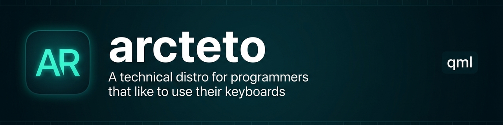

<p align="center">
  
</p>

<h1 align="center">arcteto</h1>

<p align="center"><b>ISO live de Arch Linux personal, con Hyprland, Noctalia Shell, entornos aislados por TTY y FocusLock — hecha para el propio autor, no para ser fácil.</b></p>

<p align="center">
  
  
  
  
</p>

---

## Qué es

Un perfil de [archiso](https://gitlab.archlinux.org/archlinux/archiso) que compila una ISO live booteable de Arch Linux con el setup completo del autor: Hyprland + Noctalia Shell, fish como shell, toolchain de desarrollo (rust, python, bun, docker), Btrfs con snapshots de snapper, drivers y tooling de GPU AMD/Intel, e instalación guiada al disco. Incluye además un sistema de **entornos aislados por TTY** (`arcteto-env`) y **FocusLock**, un mecanismo de compromiso para estudio donde un agente custodia la contraseña de desbloqueo.

**En una frase:** el checkpoint instalable de la distro personal de Gabriel — lo que él bootea, no un producto para terceros.

## Estado

| | |
|---|---|
| **Estado** | activo |
| **Última actividad** | 2026-08 (commit `690010e`, fix de `--share` en `arcteto-env`) |
| **Se puede usar hoy** | sí, como ISO propia del autor: `just build` la compila y `just run` la prueba en QEMU (instalación apuntada a UEFI) |
| **Lo que falta** | ver [TODO.md](TODO.md): tests automatizados en QEMU, integración de Kateto (agente con opencode + llama.cpp), sistema de backups, bindings de tooling Noctalia (OCR, palette scanner), reorganizar scripts en subcarpetas, docs |
| **Riesgos / deuda conocida** | el repo local de paquetes custom en `/local/repo` puede dar problemas (notado en el README original); error conocido en el config de Hyprland (línea 366, source de archivo inexistente); la build corre `su -c` para mkarchiso |

## Por qué existe

Es el punto de control (checkpoint) de la distro personal del autor: una ISO que reproduzca su setup — scripts, configs, herramientas — para reinstalar sin rehacer todo a mano. No nació como distribución para terceros y lo dice explícitamente: *"it is not made to be easy"*. A futuro, Kateto la haría opcionalmente "fully agentic".


## Instalación y uso

Requisitos: Arch Linux (o similar) con `archiso`, `fish` y [just](https://github.com/casey/just); QEMU con KVM y firmware OVMF para probar. Los wallpapers propios van en `~/Imágenes/Wallpapers/` (el build los copia); configs propias listadas en `configs.d`.

```bash
git clone https://github.com/Gonanf/arcteto.git
cd arcteto
just build            # compila la ISO (con paquetes custom)
just build-run        # compila y arranca en QEMU
just run              # corre una ISO ya compilada
just build-no-custom  # compila sin el repo de paquetes custom
just clean            # borra artefactos (out/, archiso-tmp/, ...)
```

Variables persistentes de fish (`set -U`) que ajustan la VM de QEMU:

| Variable | Descripción | Default |
|---|---|---|
| `ARCTETO_ISO_PATH` | archivo usado como disco de la VM | `./temp.raw` |
| `ARCTETO_MEMORY` | RAM de la VM | `16G` |
| `ARCTETO_SIZE` | tamaño de disco en `$ARCTETO_ISO_PATH` | `50G` |
| `ARCTETO_EXTRA_PARAMS` | parámetros extra de QEMU | `-accel kvm` |

Dentro del live, la instalación guiada (`setup.fish`) configura Btrfs con subvolumes (@, @root, @home, @snapshots), snapper, systemd-boot, los paquetes custom y autologin a Hyprland.

## Entornos aislados y FocusLock

`arcteto-env` crea un entorno aislado en un TTY propio: autologin a un usuario separado opcional (UID 10xx con grupos input/seat), DNS filtrado opcional (dnsmasq por entorno en `5335+TTY` + nftables que tira DoT/QUIC), apps de autostart y config de Hyprland propia del entorno.

```fish
arcteto-env                       # interactivo (zenity)
arcteto-env --name study --tty 2 --user study \
    --dns "youtube.com,tiktok.com,reddit.com" --apps "zen affine"
```

Flags: `--name`, `--tty`, `--user` (usuario aislado; sin él + `--no-user` usa el usuario principal), `--dns` (blocklist separada por comas), `--apps` (separada por espacios), `--wallpaper`, `--no-user`, `--clone-from`, `--kill`, `--share` (bindfs), `--apparmor-deny`.

**FocusLock** es un uso específico de ese sistema + un lock de sesión: `focuslock-engage` genera una passkey aleatoria, guarda su SHA256 en el secret de PAM, bloquea la sesión con hyprlock (servicio PAM `focuslock`) y te manda al TTY2 de estudio. La passkey la custodia el agente, no vos — ese es el compromiso. Piezas: `focuslock-setup.fish`, `focuslock-engage.fish`, `/etc/pam.d/focuslock` + `focuslock-check`, `/etc/dnsmasq-focuslock.conf` + servicio, `/etc/nftables-focuslock.conf`. El diseño completo y la rationale están en el blog del autor.

## Stack

- **Lenguaje / runtime:** fish (scripts y funciones de sistema), bash para el perfil archiso, [just](https://github.com/casey/just) como task runner
- **Base:** archiso (perfil propio derivado de `releng`)
- **Escritorio:** Hyprland, Noctalia Shell, fuzzel, ghostty, pipewire
- **Infra / servicios:** dnsmasq + nftables (DNS filtrado), bindfs (shares), apparmor, snapper, systemd-boot
- **AUR:** noctalia-shell, noctalia-qs, zen-browser-bin, paru, rocm-smi (repo custom en `/local/repo`)

## Estructura del repo

```
airootfs/                        # overlay del sistema live: /etc, configs de usuario, scripts
airootfs/root/.config/fish/      # funciones: setup, arcteto_install, arcteto-env, focuslock-*, ...
build.fish                       # wrapper de mkarchiso (+ build de paquetes custom)
build-custom-packages.fish       # compila los paquetes de AUR al repo local
start_emu.fish                   # corre la ISO en QEMU
test_disk.fish                   # prueba el disco virtual
Justfile                         # tasks (build, run, test, clean, ...)
packages.x86_64                  # se regenera en el build (releng + custom + AUR)
profiledef.sh                    # metadata y bootmodes de la ISO
pacman.conf                      # repos para el build, incluye el custom
tests/                           # suite de tests en fish (sintaxis, configs, deps, instalación)
TODO.md                          # pendientes y errores conocidos
```

## Roadmap

- [ ] Integrar Kateto (opencode + scripts + llama.cpp) y sus servicios
- [ ] Tests automatizados en QEMU
- [ ] Sistema de backups
- [ ] Bindings de tooling Noctalia (OCR, palette scanner)
- [x] Sistema genérico de entornos por TTY (`arcteto-env`)
- [x] FocusLock con custodia de passkey por el agente
- [x] Repo de paquetes custom/AUR integrado al build

## Notas y decisiones

- Perfil derivado del `releng` oficial de archiso: se heredan bootmodes BIOS+UEFI y hooks; el valor diferencial está en el overlay de `airootfs/` y los scripts de fish.
- El setup de instalación está basado en [Easy Arch](https://github.com/classy-giraffe/easy-arch) (Btrfs + subvolumes + snapper).
- El repo de paquetes AUR custom se compila en el build y se sirve desde `/local/repo` via pacman; el propio README original advierte que puede dar problemas.
- Los wallpapers NO van al repo (`.gitignore` los excluye); se levantan de `~/Imágenes/Wallpapers/` en cada build.

## Licencia

GPLv3 (según el README original del repo).
